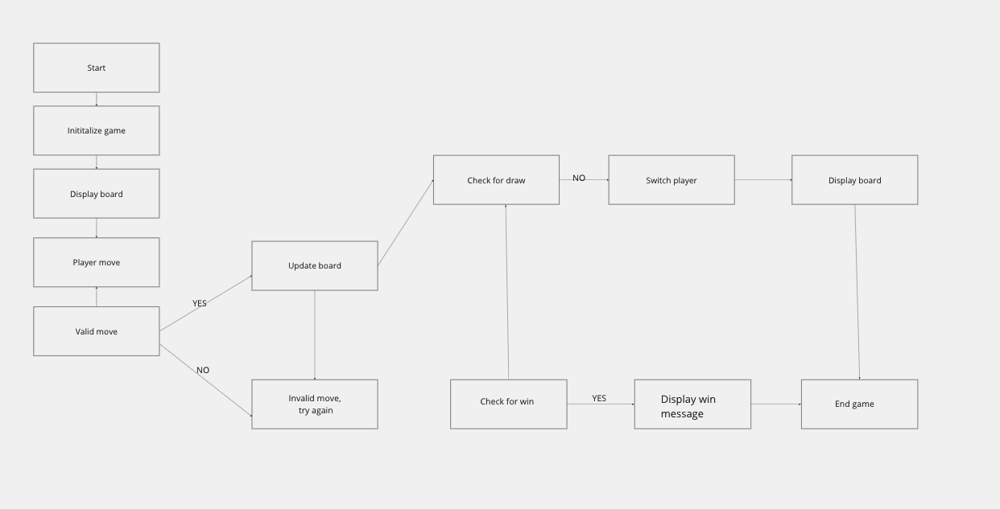
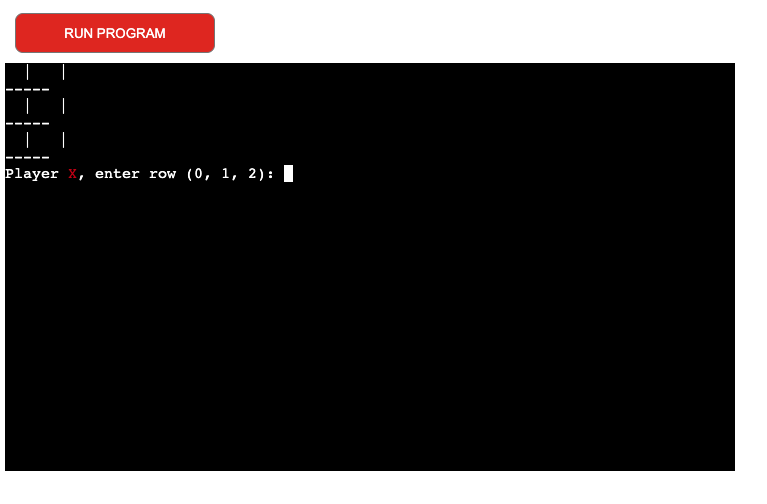
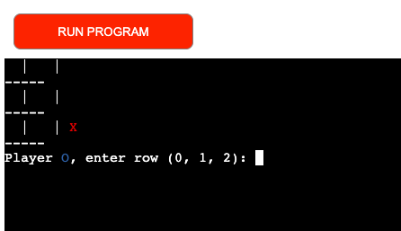
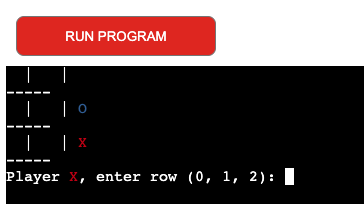
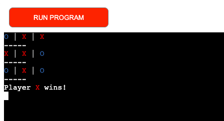
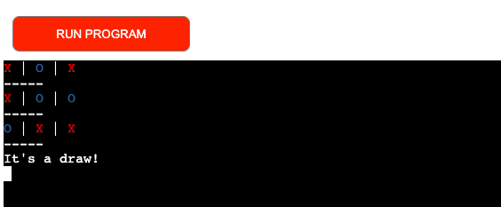
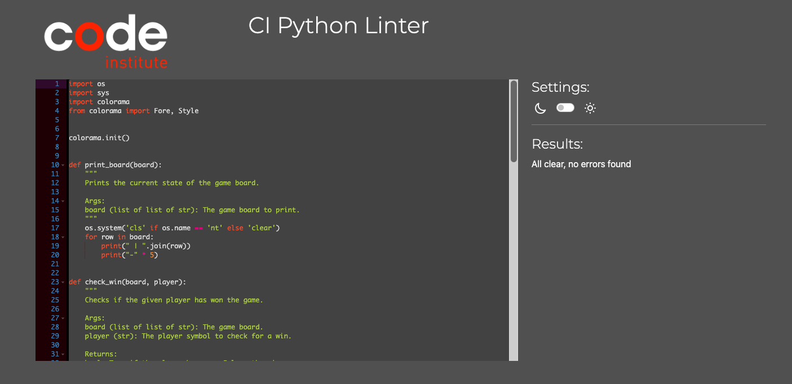

# Tic Tac Toe

How to Play
The game board is a 3x3 grid.
Players take turns to place their markers (X and O) on the grid.
The first player to get three of their markers in a row (horizontally, vertically, or diagonally) wins.
If the board is full and no player has won, the game ends in a draw.

## Site Purpose

The purpose of the site is to provide an interactive platform for playing Tic Tac Toe (also known as Noughts and Crosses) online. It aims to offer a user-friendly interface where players can enjoy the game, learn the rules, and compete against each other.

## Project's Aim

The aim of the project is to develop a web application that allows users to play Tic Tac Toe in their web browser. The project seeks to implement the game logic, user interface, and functionality to support various user interactions, including starting the game, making moves, tracking game progress, and determining the winner. Additionally, the project aims to provide error handling for invalid moves and support for playing multiple rounds seamlessly.

## Flowchart
* Start the game 
* Player 1 (X) starts
* Shows the gameboard
* Player 1 or 2 makes a move
* Check if the move is valid
* If invalid, go back to Player move if valid update gameboard
* Check for win 
* If Win display win meassage and end the game.If no, proceed to the next step
* Check for draw. If draw end the game. If no, proceed to next step. 
* Switch player. If it was player 1, swith to player 2 and vice versa)
* Repeat. Go back to "Display the game board" 
* End the game

1. **Start of the Game**
   

2. **Player 1's Move**
   

3. **Player 2's Move**
   

4. **Winning Move**
   

5. **Draw Game**
   

## User Stories

* **User 1:** As a new player I want to be able to start the game and receive a brief instruction on how to play, so that I can quickly understand the rules and get started.

* **User 2:** As an active player I want to see the current game board after each move, so I can keep track of the game's progress and plan my next moves.

* **User 3:** As a player I want to be notified when someone wins the game or if it ends in a draw, so I know when the game is over and who the winner is.

* **User 4:** As an erroneous user I want to receive clear error messages if I make an invalid move, so I can understand what went wrong and try again.

* **User 5:** As a serious player I want to be able to play multiple rounds without having to manually restart the program, so I can continue playing without interruption.

## Testing
**Family and friends**
Family and friends tried the game and find it easy to understand and worked smooth. 

### Automated testing
Tested the code thrue Python Linter before submitt and found no errors. 

### Language Distribution
* HTML
* Python: 
* JavaScript
* Dockerfile
* Shell
* Procfile
    
### Fixed bugs
* There were several bug that I fixed 
* Fix Indentation Issues in main Function
* Fix the Use of _ Instead of Space in List Comprehensions
* Fix Missing Characters and Syntax Errors:
 - Ensure all quotes and parentheses are closed correctly.
 - Correct the operators and punctuation.

## Deployment
 The app was deployed through Heroku. The steps are as following:

1. Log into Github and locate [Github Repository](https://rosencrantzart.github.io/tiktaktoe/).
2. After creating a Heroku account, click "New" to create a new app from the dashboard.
3. Create a unique name for the app and select your region: press "Create app".
4. Go to settings and add the necessary Config_vars and buildpacks. Ensure that the buildpacks are set to `Python` and `NodeJS`.
5. Click `Deploy`.
6. Scroll Down to Deployment Method and select GitHub.
7. Select the name of the repository from Github to be deployed and connect to Heroku.
8. Scroll down to the deploy options: 
Click enable Automatic deploys (Will Update Automatically with every "git push"). This was chosen for this project.

### Acknowledgements
## Acknowledgments
- To all of the amazing coders on Youtube that share several tutorials.  
- To everyone on slack that always answer to questions on all levels. 
- My mentor Rory Patrick, educational and help me to stay calm. 

## Contact
For contributions or feedback, email anrosencrantz79@gmail.com

